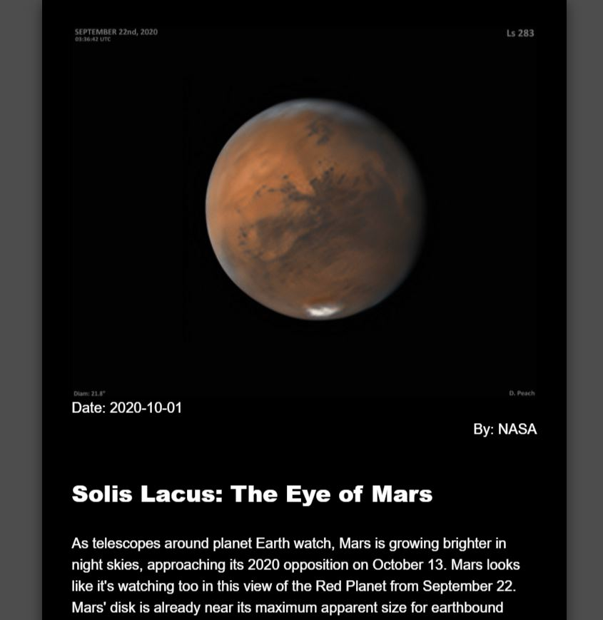

# Nasa Photo Of The Day App
This is an app that displays a new photo each day using a NASA API.

# Check it out here
https://nasa-photo-of-the-day-three.now.sh/

# Motivation
I built this project for Lambda School. 

---

## Table of Contents

- [Installation](#installation)
- [Features](#features)
- [Support](#support)
- [Tech](#tech)

---

# Screenshots


<br />

# Tech

#### Built with
- [React][react]
- [Chart.js][chartjs]
- [Material-ui][material]

# Features
This project has a minimal design with data from a NASA API displayed into a card that has a floating animation as if it's in space. It dynamically updates every day with the new image, date, and description.

# Code Example
```
function App() {
  // set useState and pull in data from API
  const [date, setDate] = useState();
  const [title, setTitle] = useState();
  const [url, setUrl] = useState();
  const [explanation, setExplanation] = useState();

  // axious request to the API
  // grab specific data
  useEffect (() => {
    axios.get(`https://cors-anywhere.herokuapp.com/https://api.nasa.gov/planetary/apod?api_key=OYB9iH2UyhXcplnYm1eMwAi6CRMi30yyTEKOpd99`)
      .then (response => {
        console.log(response.data);
        setDate(response.data.date);
        setTitle(response.data.title);
        setUrl(response.data.url);
        setExplanation(response.data.explanation);
      })
      .catch(err => console.log(err));
  }, []);

    if (!url) return <Loading />;
  return (

    // Display component on page
    <div className="App">
      <p>
        {/* {<Loading />} */}
        <PicOfTheDay
        date={date}
        title={title}
        url={url}
        explanation={explanation}
        />
      </p>
    </div>
  );
}
  ```

# Installation

> Clone to your local machine
`https://github.com/ardissam0/nasa-photo-of-the-day.git`

> Setup
```
$ npm i
$ npm start
```

# API Reference
https://api.nasa.gov/planetary/apod?api_key=OYB9iH2UyhXcplnYm1eMwAi6CRMi30yyTEKOpd99

# Support
Reach out to me on social media if you have any questions!

[][twitter]
[][linkedin]
[][instagram]

[website]: https://samardis.com/
[twitter]: https://twitter.com/samuel_ardis
[instagram]: https://www.instagram.com/samuel.d.ardis/
[linkedin]: https://www.linkedin.com/in/samuel-ardis/
[react]: https://reactjs.org/
[chartjs]: https://www.chartjs.org/docs/latest/
[material]: https://material-ui.com/
